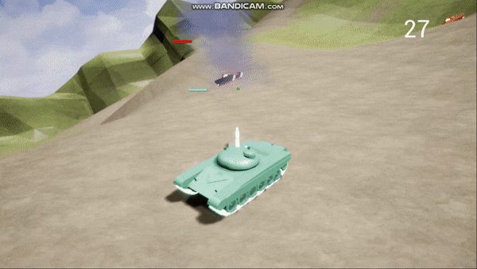
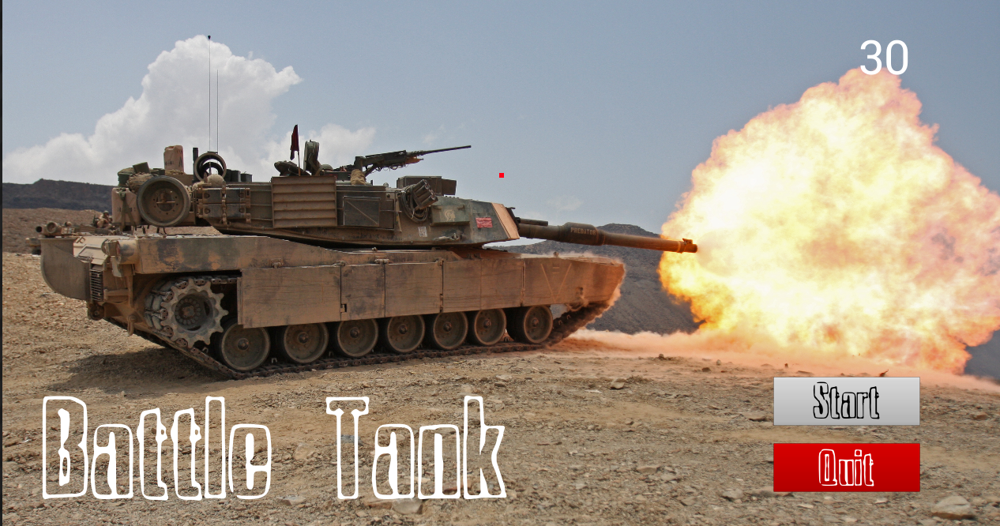
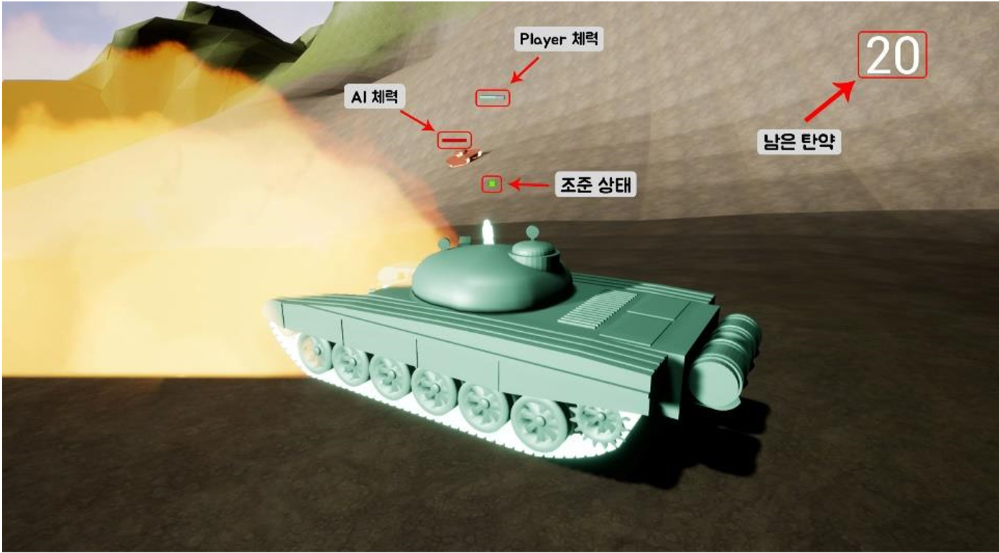

# Portfolio - BattleTank

## 실행 영상

---
 

## 조작법
### 이동

- 전 후 이동 : W, D
- 좌 우 회전 : A, 

### 공격

- 공격 : 마우스 좌클릭

 

---

## UI

### 시작 화면

### 플레이 화면

 
---
 

Unreal Creator course on Udemy : [here](https://www.udemy.com/unrealcourse/learn/v4/overview)
 
Github Repo : [here](https://github.com/UnrealCourse/04_BattleTank)

